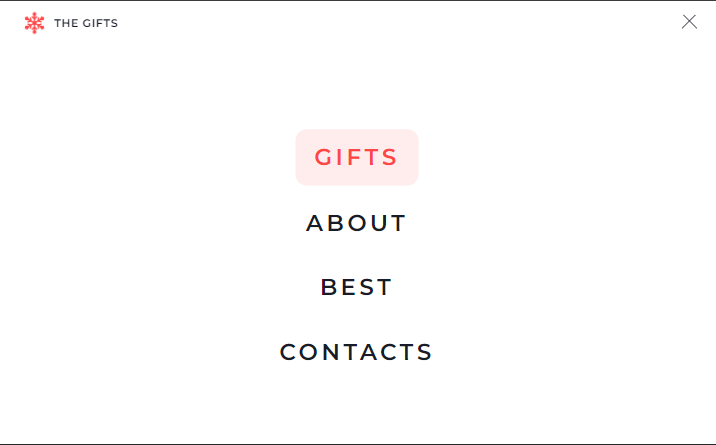
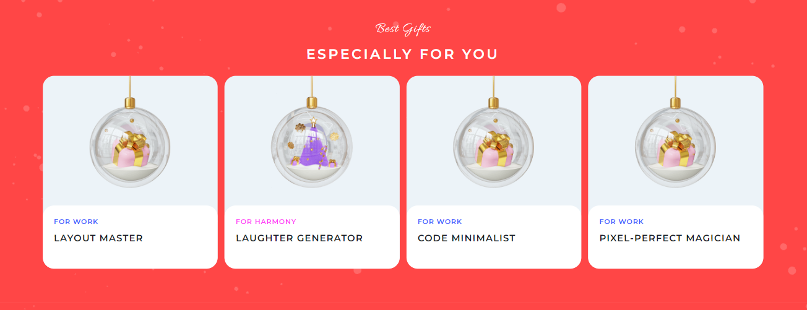
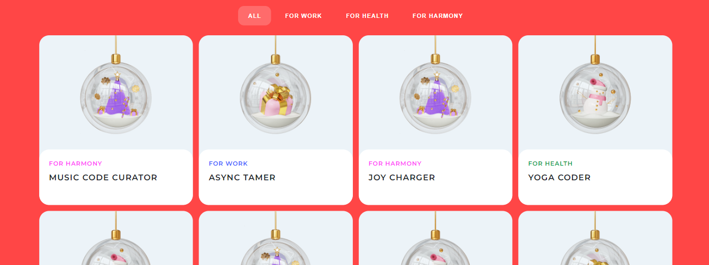
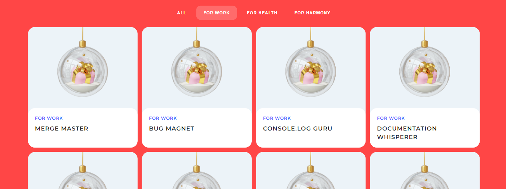
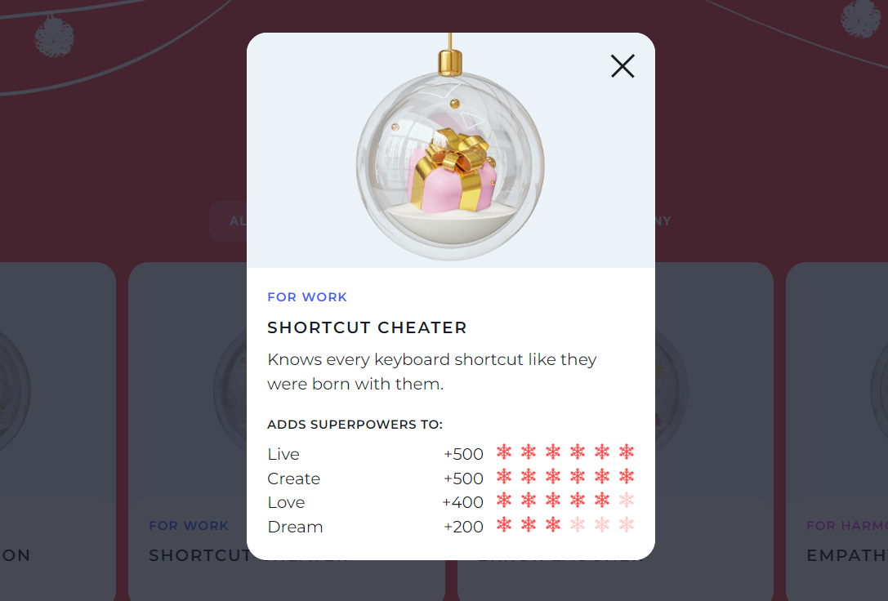

# Christmas Shop 🎄

**Christmas Shop** is a [training project](https://github.com/rolling-scopes-school/tasks/blob/master/tasks/christmas-shop/christmas-shop.md) developed as part of the RSSchool "Frontend" course in November 2024. This website is dedicated to the Christmas theme and showcases skills in adaptive and responsive layout, as well as the use of native JavaScript for adding interactivity.

The project is adapted for desktop and mobile devices with a minimum screen width of 380px and is built using the Pixel Perfect, desktop-first approach.

## Table of Contents
- [Christmas Shop 🎄](#christmas-shop-)
  - [Table of Contents](#table-of-contents)
  - [Demo](#demo)
    - [Key Features](#key-features)
  - [Functionality](#functionality)
    - [Burger Menu](#burger-menu)
    - [Slider](#slider)
    - [Random Gifts](#random-gifts)
    - [Timer](#timer)
    - [Gift Category Switching](#gift-category-switching)
    - [Back to Top Button](#back-to-top-button)
    - [Modal Window](#modal-window)
  - [Technologies](#technologies)

## Demo
**Live Demo:** [Open the website](https://cherkasovaa.github.io/christmas-shop/)

### Key Features
- Adaptive and Responsive Layout (Desktop First)
- Support for devices with resolutions from 380px to desktop
- Pixel Perfect layout
- Unique Christmas design
- Smooth animation of elements
- Cross-browser compatibility

## Functionality

### Burger Menu

**Description:** Opens and closes the burger menu on pages with a screen width of 768px and less.

**Screenshot:** 

### Slider

**Description:** Image slider on the main page. The slider scrolls completely after three button clicks on screens up to 768px wide, and up to six clicks on wider screens. The slider is not cyclical, and the shift button is disabled at the extreme positions.

**Screenshot:**

### Random Gifts

**Description:** Displays random gifts on the main page upon page reload. Clicking on a gift card displays a centered modal window with details.

**Screenshot:**

### Timer

**Description:** Countdown timer to New Year on the main page. The timer is annually reconfigured to count down to the next New Year according to UTC+0.

**Screenshot:**

### Gift Category Switching

**Description:** Allows switching between gift categories on the gifts page.

**Screenshot:**

### Back to Top Button

**Description:** Button for quickly returning to the top of the page on the gifts page. The button smoothly appears only on the gifts page when scrolling 300px from the top and is not displayed on the main screen, as per the project specifications.

**Screenshot:**

### Modal Window

**Description:** Modal window for the selected product on both pages. Displays additional information about each gift: category, name, description, and "superpower" information. Depending on the amount of superpower (from +100 to +500), a corresponding number of "snow" ratings is displayed, where one snowflake equals +100 superpower points.

**Screenshot:**

## Technologies
- HTML5
- SCSS
- Native JavaScript
- Desktop-First Principle
- Responsive Layout
